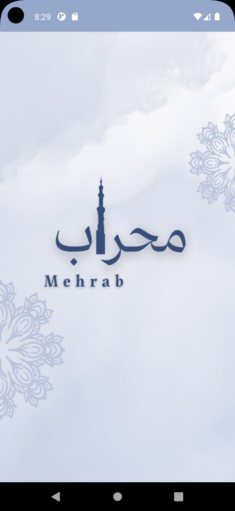
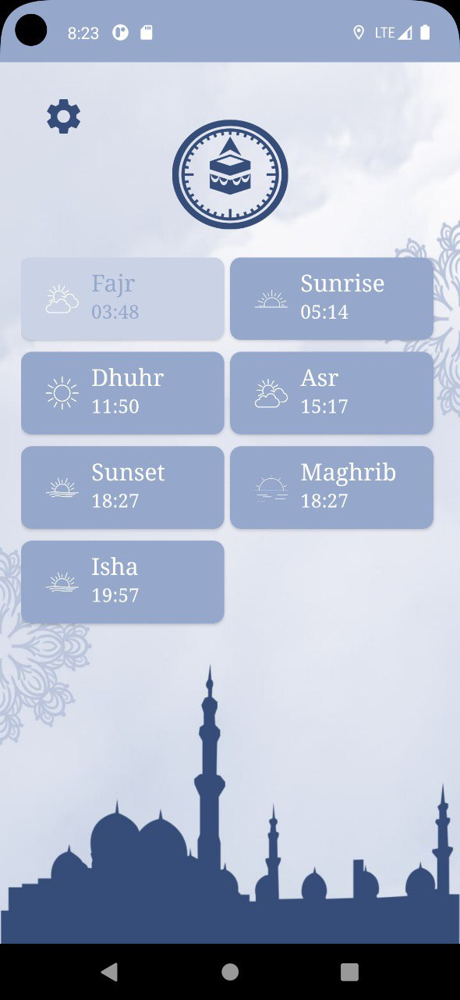
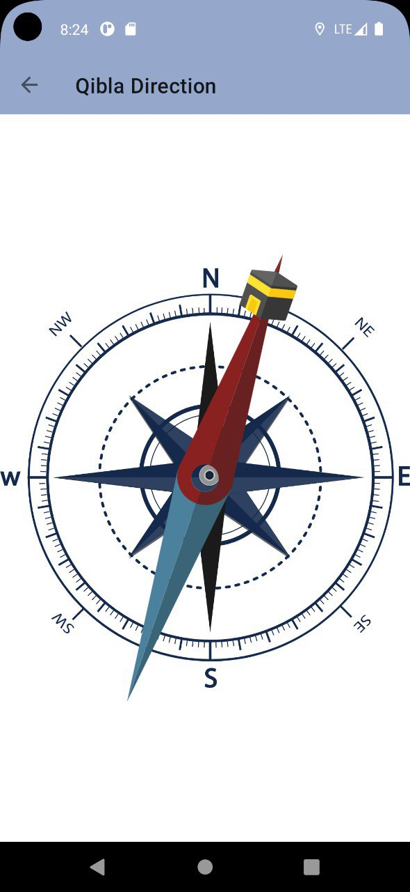
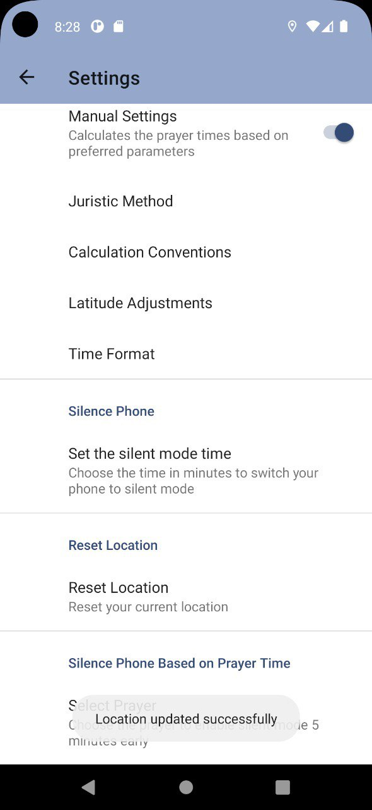
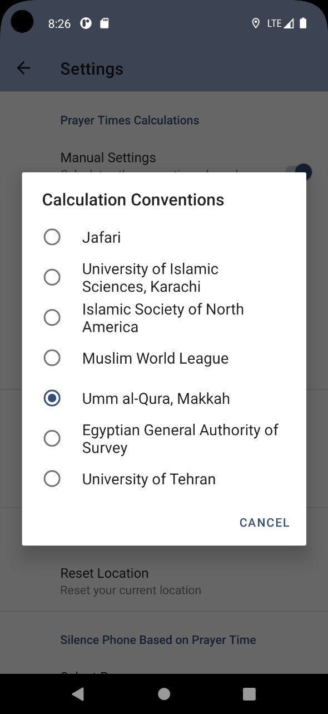

<h1 align="center">Mehrab: Prayer Notifier App</h1>
   
Mehrab is a prayer notifier app for Android developed in Android Studio. It offers accurate prayer timings, customizable actions, and a Qibla direction finder to enhance the prayer experience. Users can set reminders, adjust prayer times based on location, and personalize their prayer experience with custom actions. With Mehrab, staying connected with one's faith and maintaining a consistent prayer routine becomes more convenient and tailored to individual preferences.

## App Features

1. **Prayer Time Calculation**
   - Uses default values needed to calculate prayer times (Shafii juristic method, Umm al-Qura, Makkah calculation method, 12-hour time format, no adjustments for Higher Latitudes).
   - Allows customization of these values from the settings page.

2. **Prayer Time Notifications**
   - Notifies users when a prayer time enters.

3. **Silent Mode**
   - Grants users the ability to switch the phone to silent mode for a specified period to avoid ringing if the user is in a mosque.

4. **Qibla Direction Finder**
   - Uses a compass to find the direction of Qibla for accurate prayer alignment.
  
   
## Project Details

### Challenges
- **Integration of Student Work**: Coordinating and merging code from different contributors while ensuring a seamless and cohesive functioning of the app.
- **Managing Complex Class Structure**: Ensuring proper integration of numerous classes for accurate prayer notifications.
- **Achieving Accurate Prayer Notifications**: Implementing algorithms for precise prayer times based on location and time zone.
- **User Experience and Interface Design**: Creating an intuitive and user-friendly interface.

### Lessons Learned and Issue Solving Tricks
- **Effective Collaboration**: Importance of communication, regular meetings, and version control tools.
- **Comprehensive Testing**: Implementing unit tests, integration tests, and real-world scenario testing to ensure accuracy.

## Resources

1. [Universal Logic for finding Qibla direction](https://stackoverflow.com/questions/41036933/universal-logic-for-finding-qibla-direction)
2. [figma](https://www.figma.com)

## Interface

  
  
  
  
  
  
 

## Color Palette 

 `#FEFEFF`
 
 `#DDDAED`
 
 `#848BBA`
 
 `#A691C8`
 
 `#724FAB`
 
 `#354d78`
 
 `#95a8cc`
 
 `#FDE992`
 
 `#24273E`

